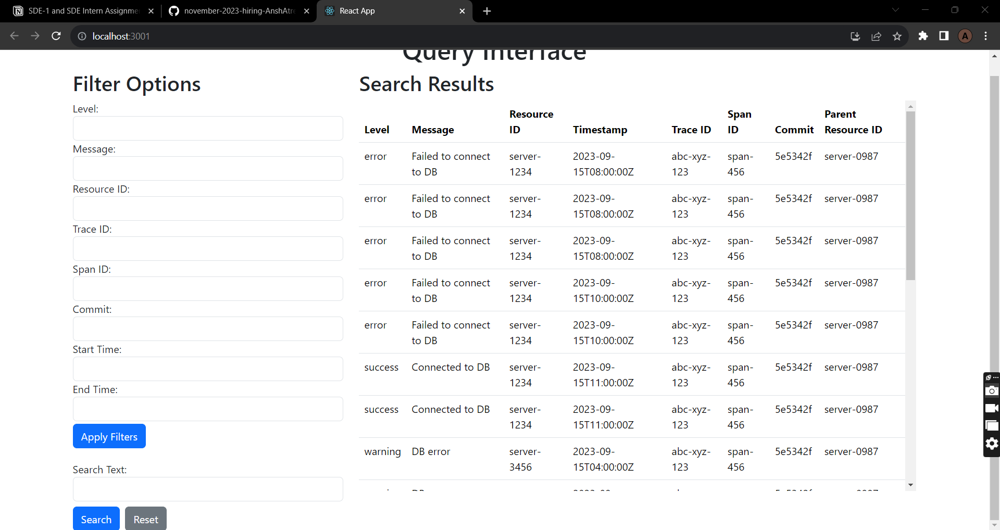
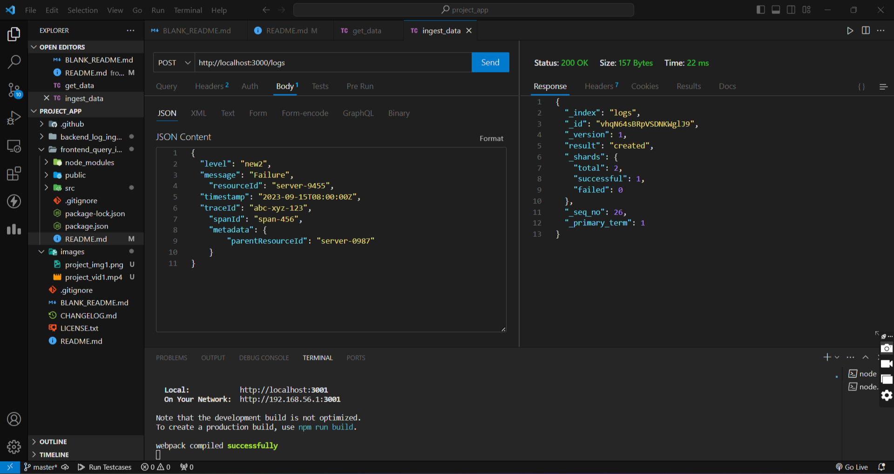

<a name="readme-top">Created by Ansh Atreja</a>

<h3 align="center"></h3>

  <p align="center">
    Log Ingestor and Query Interface
  </p>
</div>

## About The Project

This is a log ingestor and query interface system where logs can be ingested and can be retrieved using the query interface

Image for User Interface


Image showcasing entering logs into server


Video showcasing project
[](videos/project_vid.mp4)

These images and videos are located in the "images" folder in this repository


<p align="right">(<a href="#readme-top">back to top</a>)</p>


### Built With

* React.js
* Node.js
* Express.js
* Elasticsearch
* Bootstrap

<p align="right">(<a href="#readme-top">back to top</a>)</p>


### Prerequisites

Ensure you have Node.js installed

### Installation

1. Clone the repo
   ```sh
   git clone https://github.com/dyte-submissions/november-2023-hiring-AnshAtreja.git
   ```
2. Install NPM packages
   ```sh
   npm install
   ```
3. If there are any pending packages, install them
4. Download Elastic Search on your system, follow https://www.elastic.co/guide/en/elasticsearch/reference/current/zip-windows.html
5. Once downloaded, open cmd in the folder and run ( this may take some time )
  ```
  .\bin\elasticsearch.bat
  ```
6. Once the service is started, go inside the config folder, go to certs folder and find a file named as http_ca.crt.
7. Copy this file to your backend_log_ingestor folder.
8. Now run command in the backend_log_ingestor terminal to start server
```
  node server.js
```
9. Now you can ingest the data with a post request on http://localhost:3000/logs with json content as body.
10. Now go to your frontend_query_interface folder terminal and write npm run start to start the react app
11. You may now use the app


<p align="right">(<a href="#readme-top">back to top</a>)</p>


## Usage

You can ingest the data using a post request on https://localhost:3000/logs
Now to retrieve the data either you can use the Query Interface or you can directly call API's fro JSON response
API's available are -:
1. http://localhost:3000/logs/search?{params}
    example for searching logs with level as error and resourceId as server-9455, make an API call http://localhost:3000/search?level=error&resourceId=server-9455

2. http://localhost:3000/logs/fulltext?{param}
    example for searching logs whereever the term "Failed to connect appears", we can call api http://localhost:3000/fulltext?text=Failed%20to%20connect

<p align="right">(<a href="#readme-top">back to top</a>)</p>


## Features

1. Provides full text search across logs
2. Included filters based on level, spanId, resourceId, timestamp, commit, spanId and traceId
3. Multiple filters can be used at a time
4. Single page application, no reload required
